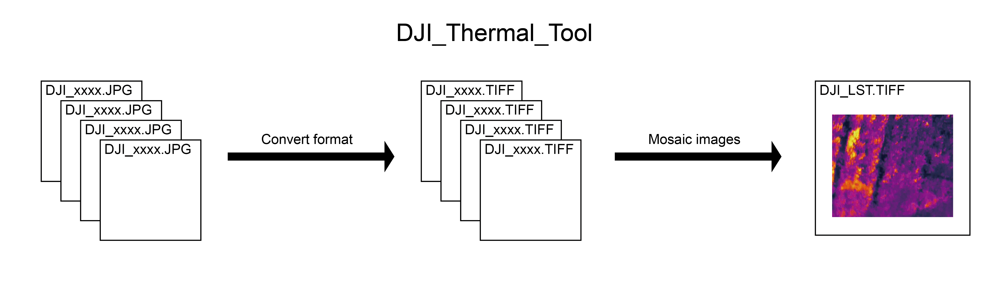

# DJI Thermal Image Processing - User Guide



## What This Tool Does

This tool converts DJI thermal camera JPG images into temperature-data TIFF files that can be used in Pix4Dmapper for creating thermal orthomosaics. It preserves GPS coordinates, camera metadata, and temperature information from your thermal images.

**Supported DJI Thermal Cameras:**
- M2EA, M30T, M3T, M3TD, M4T
- H20T, H20N, H30T
- Zenmuse XT S

## System Requirements

- **Operating System:** Windows or Linux (macOS not currently supported)
- **Python:** Version 3.9 or higher - [Download Python](https://www.python.org/downloads/)
- **UV:** Python package manager - [Install UV](https://github.com/astral-sh/uv)
- **Pix4Dmapper:** For orthomosaic creation - [Get Pix4Dmapper](https://www.pix4d.com/product/pix4dmapper-photogrammetry-software/)

## Quick Start Guide

### Step 1: Extract the Package

1. Unzip the downloaded package to your desired location (e.g., `C:\DJI_Thermal_Tool\`)
2. Extract the required zip files:
   - Extract `dji_thermal_sdk_v1.7_20241205.zip` to create `dji_thermal_sdk_v1.7_20241205/` folder
   - Extract `exiftool-13.29_64.zip` to create `exiftool-13.29_64/` folder
3. After extraction, you should see this folder structure:

```
DJI_Thermal_Tool/
├── main.py
├── extract_metadata.py
├── jpg2tiff.py
├── copy_metadata.py
├── pyproject.toml
├── uv.lock
├── dji_thermal_sdk_v1.7_20241205/
└── exiftool-13.29_64/
```

### Step 2: Prepare Your Thermal Images

1. Create a `main` folder inside the extracted package folder
2. Inside `main`, create subfolders for each flight mission
3. Place your thermal images in these subfolders

**Required folder structure:**

```
DJI_Thermal_Tool/
├── main/
│   ├── mission_01/
│   │   ├── DJI_0001_T.JPG
│   │   ├── DJI_0002_T.JPG
│   │   └── ...
│   ├── mission_02/
│   │   ├── DJI_0010_T.JPG
│   │   └── ...
│   └── ...
└── (other files)
```

**Important:** Only thermal images with filenames ending in `_T.JPG` or `_INFRA.JPG` will be processed. Regular RGB images will be moved to an `other` folder automatically.

### Step 3: Setup the Environment

Open a terminal/command prompt in the extracted folder and run:

**Windows:**
```bash
uv sync
.venv\Scripts\activate
```

**Linux:**
```bash
uv sync
source .venv/bin/activate
```

This installs all required dependencies and activates the Python environment.

### Step 4: Process Your Images

**Option A: One-Command Processing (Recommended)**

Run this single command to process all images:

```bash
uv run python main.py -d main
```

Or if your environment is already activated:

```bash
python main.py -d main
```

**Option B: Step-by-Step Processing**

If you prefer to run each step separately:

```bash
# Step 1: Extract metadata
uv run python extract_metadata.py -d main

# Step 2: Convert JPG to TIFF
uv run python jpg2tiff.py -d main

# Step 3: Copy metadata to TIFF files
uv run python copy_metadata.py -d main
```

**Processing time:** Expect 1-5 seconds per image depending on your computer.

### Step 5: Use Output in Pix4Dmapper

After processing completes:

1. Open Pix4Dmapper and create a new project
2. Import images from the `out_dir` folder inside each mission subfolder:
   - Example: `main/mission_01/out_dir/*.tiff`
3. **Important:** Select the **"Thermal Camera"** processing template
4. Configure processing options:
   - If initial processing fails, try changing "Keypoints Image Scale" to 1/2, 1/4, or 1/8
   - Menu: Process > Processing Options > Initial Processing > General
5. Start processing to generate your thermal orthomosaic

## Understanding the Output

After processing, each mission subfolder will contain:

```
main/
└── mission_01/
    ├── input_dir/              # Original thermal JPG images moved here
    │   └── DJI_***_T.JPG
    ├── out_dir/                # Converted TIFF files (USE THESE in Pix4D)
    │   └── DJI_***_T.tiff
    ├── other/                  # Non-thermal images moved here
    └── metadata.txt            # Extracted metadata in CSV format
```

**What to use:**
- **out_dir/*.tiff** → Import these into Pix4Dmapper for thermal orthomosaic creation
- **metadata.txt** → Contains GPS coordinates, camera parameters, and orientation data

**Temperature data format:** Each pixel in the TIFF file represents temperature in 0.1°C units.

## Best Practices for Image Collection

For best orthomosaic results, follow these guidelines when capturing thermal images:

### Flight Parameters

| Parameter | Recommended Value | Why |
|-----------|------------------|-----|
| **Time span** | ≤ 1 hour | Surface temperatures change rapidly throughout the day |
| **Image overlap** | ≥ 80% (front & side) | Ensures successful image matching and stitching |
| **Gimbal angle** | 90° (nadir/vertical) | Standard for orthomosaic generation |
| **Flight speed** | ≤ 4 m/s | Prevents motion blur; consider hover capture |
| **Flight altitude** | 100-200m | Balance between coverage and resolution |

### Why These Matter

- **Time span:** Thermal images taken hours apart will show different temperatures for the same objects, causing poor stitching
- **High overlap:** Thermal images have less visual features than RGB images, requiring more overlap for matching
- **Vertical capture:** Ensures consistent scale and perspective across the orthomosaic
- **Low speed:** Thermal cameras are more sensitive to motion blur than RGB cameras

## Troubleshooting

### "ExifTool not found" Error

**Problem:** The program cannot find ExifTool executable.

**Solution:**
1. Check that `exiftool-13.29_64/` folder exists in your package
2. **Windows:** Verify `exiftool.exe` exists (not `exiftool(-k).exe`)
   - If you see `exiftool(-k).exe`, rename it to `exiftool.exe`
3. **Linux:** Ensure the exiftool file has execute permissions:
   ```bash
   chmod +x exiftool-13.29_64/exiftool
   ```

### No Images Processed

**Problem:** Program runs but no images are processed.

**Solution:**
- Verify your thermal images end with `_T.JPG` or `_INFRA.JPG`
- Check that images are in subfolders under `main/`, not directly in `main/`
- Ensure the folder structure matches the example in Step 2

### "DLL load failed" or SDK Errors

**Problem:** Errors related to DJI Thermal SDK.

**Solution:**
- **Windows:** Install [Microsoft Visual C++ Redistributable](https://aka.ms/vs/17/release/vc_redist.x64.exe)
- Verify `dji_thermal_sdk_v1.7_20241205/` folder is complete in your package
- Try running as Administrator

### Images Won't Stitch in Pix4Dmapper

**Problem:** Pix4D cannot process the thermal images.

**Solutions:**
1. Verify you imported files from `out_dir/` (TIFF files), not `input_dir/` (JPG files)
2. Confirm "Thermal Camera" processing template is selected
3. Reduce "Keypoints Image Scale" to 1/2 or 1/4:
   - Menu: Process > Processing Options > 1. Initial Processing > General
4. Check image overlap - you may need to recapture with higher overlap (≥90%)

### Permission Errors

**Problem:** Cannot write files or access directories.

**Solution:**
- Run terminal/command prompt as Administrator (Windows) or with sudo (Linux)
- Ensure you have write permissions in the folder where you extracted the package
- Check that antivirus software isn't blocking file operations

## Technical Details (Optional)

### Processing Pipeline

The tool performs three sequential operations:

1. **Metadata Extraction** - Identifies thermal images, moves them to `input_dir`, extracts GPS/camera data to `metadata.txt`
2. **Format Conversion** - Converts thermal JPG to temperature TIFF using DJI Thermal SDK
3. **Metadata Transfer** - Copies all metadata from original JPG to converted TIFF using ExifTool

### Why TIFF Format?

DJI thermal JPG files store temperature data in a proprietary format. The DJI Thermal SDK extracts this data and the tool converts it to standard TIFF format where each pixel value directly represents temperature (in 0.1°C units). This format is compatible with Pix4Dmapper and other photogrammetry software.

### Metadata Preservation

The tool uses ExifTool to copy ALL metadata tags from the original JPG to the TIFF file, including:
- GPS coordinates (latitude, longitude, altitude)
- Camera parameters (focal length, sensor size)
- Gimbal orientation (roll, pitch, yaw)
- Capture timestamp

This ensures accurate georeferencing and camera calibration in Pix4Dmapper.

## Need More Help?

- Check DJI Thermal SDK documentation in `dji_thermal_sdk_v1.7_20241205/doc/`
- Visit [Pix4D Support](https://support.pix4d.com/) for orthomosaic processing questions

## License

This tool uses DJI Thermal SDK components. Please refer to DJI's license terms for commercial use.